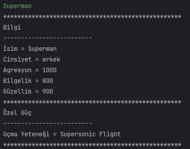
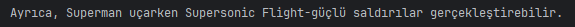
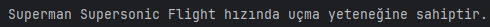
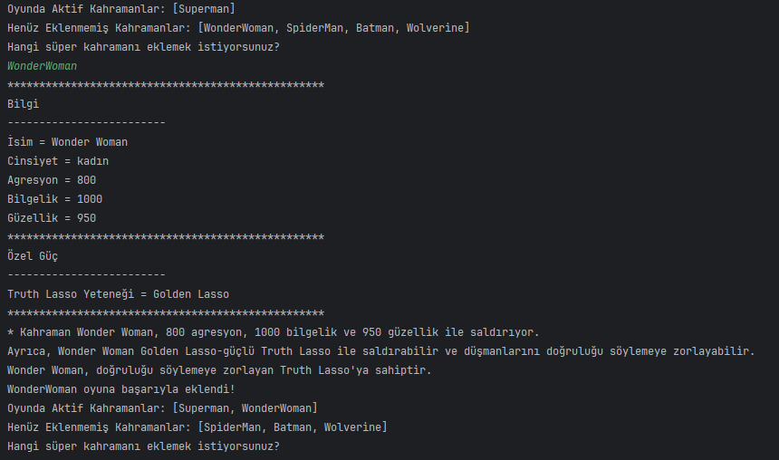
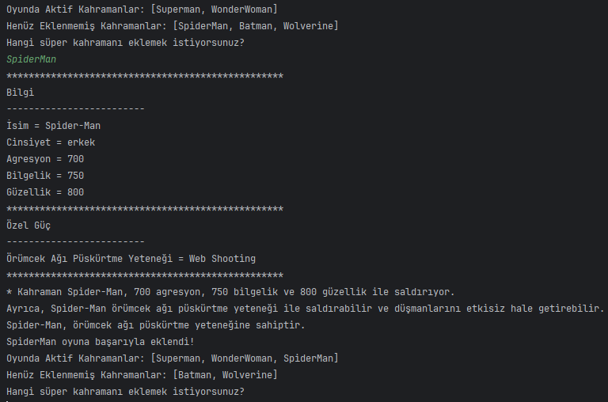
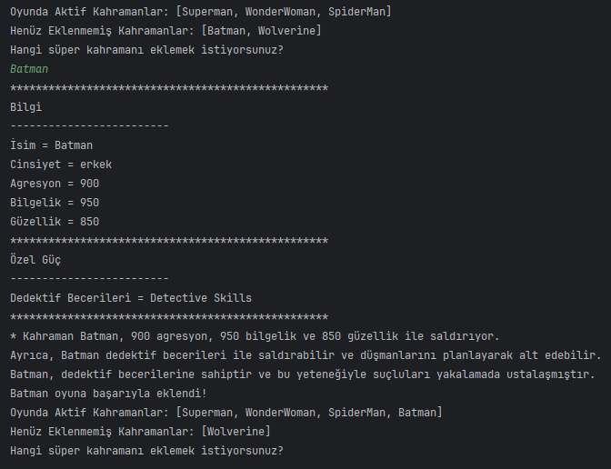
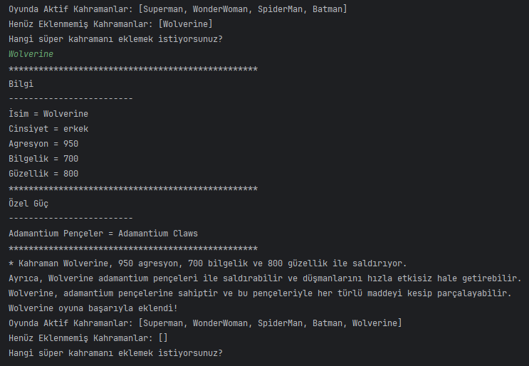
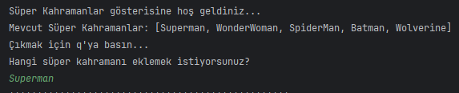
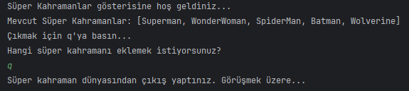
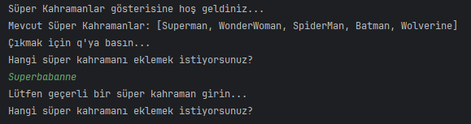

# Süper Kahramanlar Projesi

## 1. Giriş
Bu proje, temel bir bilgisayar oyunununa kahraman tasarlamak ve oyunun karakterlerini süper kahramanlara dönüştürmek için yapılmıştır. Polimorfizm, kalıtım ve kapsülleme prensiplerini içselleştirmek amacıyla OOP (Nesne Yönelimli Programlama) ilkelerini mümkün olduğunca fazla kullanınız.

### _Örnek Klasör Yapısı :_
```bash
└───src
    ├───superHero
    │       Batman.java
    │       HeroFactory.java
    │       Runner.java
    │       SpiderMan.java
    │       Readme.md
    │       SuperHeroes.java
    │       Superman.java
    │       Wolverine.java
    │       WonderWoman.java
```
---
## 2. Sınıflar ve Alanlar
### `SuperHeroes {}` Sınıfı
- Alanlar (`Fields`) :
```java
    - private name;
    - private gender;
    - private aggression;
    - private wisdom;
    - private beauty;
```

- Metodlar (`Methods(){}`) :
    - `printInfo()`: Kahramanın tüm bilgilerini yazdırır.
        Aşağıdaki örnek Superman'e özeldir. SuperHeroes sınıfınızda tüm kahramanlar için genel metodlar bulunmalı ve bu metodları kahramanlarınıza özgü hale getirmek için bunları geçersiz kılmalısınız (override etmelisiniz):
  
        
  
    - `attack()`: Kahramanın saldırı gücü hakkında oyuncuyu bilgilendirir.
        Oyuncuya Superman'in saldırı gücü hakkında bilgi vermelidir:
  
       
  
    - `exposeSecretPower()`: Eğer kahramanın gizli bir gücü varsa, bu metod oyuncuyu bu gizli güç hakkında bilgilendirir.
        Mesela, Superman'in gizli bir gücü varsa, bu metod oyuncuya bu gizli güç hakkında bilgi vermelidir. Mesela:
  
        
  
- `Getter`'lar, `setter`'lar ve kurucu metodlar (`constructor`)

### Bir arada özetleyecek olursak:


---
### Superman Sınıfı
- `SuperHeroes` sınıfını genişletir (`extends`)
- Ek Alan (Superman sınıfına has field):
    - `private flyingAbility;`
- Metodlar:
    - `printInfo()` metodunu geçersiz kıl, üzerine yaz (`@Override)`: Bu metodu Superman'e özgü hale getirir.
        SuperHeroes sınıfındaki printInfo() metodunu geçersiz kılarak (override) bu metodun Superman'e özgü hale gelmesini sağlayalım, böylece Superman hem Süper Kahraman olarak hem de kendi özelliği olarak davranabilir. Yani:
  
        
  
    - `attack()`: Superman'in saldırı gücü hakkında oyuncuyu bilgilendirir. Superman'a özel saldırı gücünü yazdırmak için, miras aldığı aynı isimdeki metodu `@Override' etmelidir.
  
        

    - `exposeSecretPower()`: Superman'in gizli gücü olan uçma yeteneğini oyuncuya bildirir.
  
        

- `Getter`'lar, `setter`'lar ve kurucu metod (`consrtuctor`)

---
### WonderWoman Sınıfı



- SuperHeroes sınıfını genişletir
- Ek Alan:
    - `private lassoOfTruthAbility;`
- Metodlar:
    - `printInfo()` metodunu geçersiz kıl: Bu metodu Wonder Woman'a özgü hale getirir.
    - `attack()`: Wonder Woman'ın saldırı gücü hakkında oyuncuyu bilgilendirir.
    - `exposeSecretPower()`: Wonder Woman'ın gizli gücü olan Truth Lasso'yu oyuncuya bildirir.
- `Getter`'lar, `setter`'lar ve kurucu metod (`consrtuctor`)

---
### SpiderMan Sınıfı



- SuperHeroes sınıfını genişletir 
- Ek Alan:
    - `private webShootingAbility;`
- Metodlar:
    - `printInfo()` metodunu geçersiz kıl: Bu metodu Spider-Man'e özgü hale getirir.
    - `attack()`: Spider-Man'ın saldırı gücü hakkında oyuncuyu bilgilendirir.
    - `exposeSecretPower()`: Spider-Man'ın gizli gücü olan örümcek ağı püskürtme yeteneğini oyuncuya bildirir.
- `Getter`'lar, `setter`'lar ve kurucu metod (`consrtuctor`)

---
### Batman Sınıfı



- SuperHeroes sınıfını genişletir
- Ek Alan:
    - `private detectiveSkillsAbility;`
- Metodlar:
    - `printInfo()` metodunu geçersiz kıl: Bu metodu Batman'e özgü hale getirir.
    - `attack()`: Batman'in saldırı gücü hakkında oyuncuyu bilgilendirir.
    - `exposeSecretPower()`: Batman'in gizli gücü olan dedektif yeteneklerini oyuncuya bildirir.
- `Getter`'lar, `setter`'lar ve kurucu metod (`consrtuctor`)

---
### Wolverine Sınıfı



- SuperHeroes sınıfını genişletir
- Ek Alan:
    - `private adamantiumClaws;`
- Metodlar:
    - `printInfo()` metodunu geçersiz kıl: Bu metodu Wolverine'e özgü hale getirir.
    - `attack()`: Wolverine'ın saldırı gücü hakkında oyuncuyu bilgilendirir.
    - `exposeSecretPower()`: Wolverine'ın gizli gücü olan adamantium pençelerini oyuncuya bildirir.
- `Getter`'lar, `setter`'lar ve kurucu metod (`consrtuctor`)

---
### HeroFactory Sınıfı
- Metodlar:
    - `produceSuperHero(String superHeroOK){ ... }` → Bu metod, süper kahramanın adını parametre olarak almalı ve süper kahraman nesnenizi döndürmelidir. Tüm constructor'ları, getter'ları ve setter'ları zaten bulunduğundan, sadece if/else if veya switch/case kullanarak girilen isme karşılık gelen süper kahraman nesnesini döndürün.

---
### Runner Sınıfı
- Bu sınıf oyunu çalıştıran `main()` metodunu içerir.
- `Runner` adında bir Java sınıfı oluşturun.
- Bu sınıfın içinde iki adet `ArrayList` kullanarak aktif kahramanları ve tüm kahramanları takip edecek field'lar tanımlayın.
        `List<String> activeHeroes = new ArrayList<>();`
        `List<String> allHeroes = new ArrayList<>();`
- `main` metodunda, tüm kahramanları içeren bir listeye (`allHeroes`). İlgili kahramanları ekleyin (Superman, WonderWoman, SpiderMan, Batman, Wolverine),
- `Scanner` sınıfını kullanarak kullanıcıdan giriş alabilmek için bir tane Scanner field'ı ekleyin.
- Oyuncuya hoş geldin mesajını ve mevcut kahraman listesini yazdırın:

  

```java
System.out.println("Süper Kahramanlar gösterisine hoş geldiniz...\nMevcut Süper Kahramanlar: " + allHeroes + "\nÇıkmak için q'ya basın...");
```
- Sonsuz bir döngü başlatın (`while (true)`).
- Kullanıcıdan bir kahraman seçmesini isteyin ve bu seçimi bir değişkene atayın.
- Eğer kullanıcı "q" tuşuna basarsa, oyundan çıkış yapın ve bir veda mesajı yazdırın: (`"Süper kahraman dünyasından çıkış yaptınız. Görüşmek üzere..."`).

  

---

### Kahraman Ekleme ve Yönetme:
- Kullanıcının seçtiği kahramanın geçerli olup olmadığını kontrol edin.
- Eğer geçerliyse, `HeroFactory` sınıfını kullanarak seçilen kahramanı oluşturun.
- Kahramanın bilgilerini (`printInfo()`, `attack()`, `exposeSecretPower()`) ekrana yazdırın.
- Aktif kahraman listesine bu kahramanı ekleyin ve bu durumu ekrana yazdırın.
- Henüz eklenmemiş kahramanları listeleyin ve ekrana yazdırın.

### Diğer Durumlar ve Hata Kontrolleri:
- Eğer kullanıcı daha önce seçilmiş bir kahramanı seçerse, buna uygun bir mesaj yazdırın.

  

- Eğer kullanıcı geçersiz bir kahraman adı girerse, buna uygun bir hata mesajı yazdırın.

  

### Metotlar ve Yardımcı Fonksiyonlar:
- Kahraman eklemek ve kahramanları listelemek için gerekli yardımcı metotları oluşturun. Mesela: 

```java
    private static List<String> getRemainingHeroes(List<String> allHeroes, List<String> activeHeroes) {
    List<String> remainingHeroes = new ArrayList<>(allHeroes);
    remainingHeroes.removeAll(activeHeroes);
    return remainingHeroes;
} 
```

### Sonlandırma:
- Program sona erdiğinde, bir veda mesajı yazdırın ve programı kapatın.
